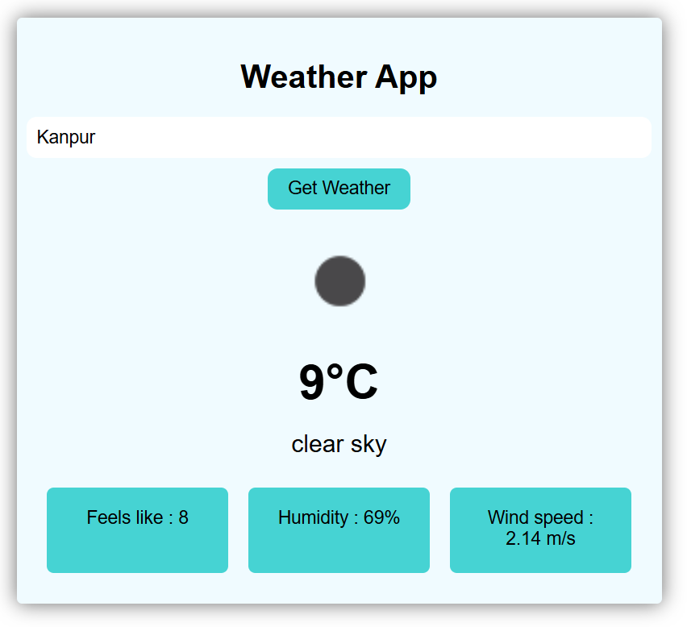

# 🌦️ Weather App

A simple and responsive **Weather Application** built using **HTML, CSS, and JavaScript**.  
This app allows users to search for any city and view real-time weather information.

---

## 🔍 Features

- Search weather by city name
- Displays current temperature
- Shows weather condition (clear sky, clouds, etc.)
- Feels like temperature
- Humidity percentage
- Wind speed
- Clean and user-friendly UI
- Responsive design

---

## 🛠️ Technologies Used

- **HTML** – Structure of the app  
- **CSS** – Styling and layout  
- **JavaScript** – Fetching weather data and dynamic updates  
- **Weather API** – For real-time weather information  

---

## 📸 Screenshot

